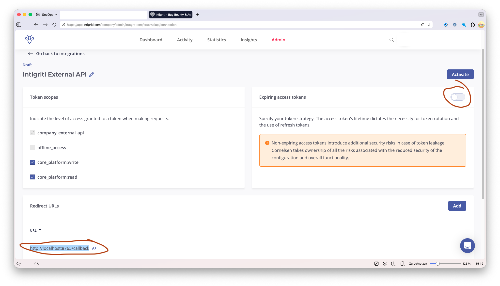
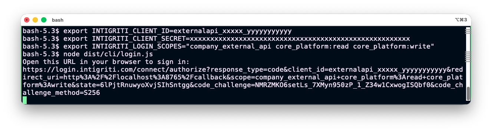

# Onboarding guide

This walks you from "nothing installed" to "Claude can read my Intigriti programs" in about 10 minutes. For deeper reference on individual env vars and tools, see the [main README](../README.md).

> **Audience:** Intigriti **company-side** users (program owners, triage). If you're a researcher submitting reports, you want a different MCP server — this one calls the company API.

---

## 1. Create an Intigriti API integration

You need an OAuth integration registered against your Intigriti company account. The MCP server uses it to obtain access tokens.

Open the External API integration page directly:

**https://app.intigriti.com/company/admin/integrations/externalapi/connection**

(or navigate via the company admin: **Admin → Integrations → External API**.)



Configure the integration on this single page:

### Token scopes

Tick the scopes the MCP server needs. The minimum recommended set:

| Scope | Why |
|-------|-----|
| `company_external_api` | Required for every tool. |
| `core_platform:read` | All read operations (programs, submissions, assets, groups, user). |
| `core_platform:write` | Mutations on submissions and program updates. |
| `offline_access` | **Required for the login helper (Path B)** — issues a refresh token so the server can auto-refresh on 401. Leave unchecked if you only use Path A (env-var token). |
| `reward_system:read` | Reading reward requests and payouts. Optional. |
| `reward_system:write` | Creating reward requests / payouts. Optional — skip if you don't manage bounties. |

### Expiring access tokens

The right-hand panel controls whether issued access tokens expire:

- **Toggle ON (recommended for login helper / Path B):** tokens expire on a short cycle, and the MCP server uses your refresh token to mint new ones automatically. Standard OAuth security posture.
- **Toggle OFF (only sensible for Path A):** the platform issues a non-expiring token. Convenient for env-var setups, but the orange warning is real — leaked non-expiring tokens stay valid until manually revoked. Don't use this unless you can keep the token in a vault.

### Redirect URLs

Add **`http://localhost:8765/callback`** to the Redirect URLs list. This is where the login helper's local listener catches the OAuth code. If you'll set `INTIGRITI_LOGIN_PORT` to a different value, register the matching URL instead.

### Activate

The integration starts in **Draft** status. Click **Activate** (top right) once scopes and redirect URLs are set. A modal opens showing the **Client ID** (format: `externalapi_<company>_<suffix>`) and the **Client Secret**.

> **The Client Secret is shown exactly once.** Copy both values into your password manager *before* closing the dialog. If you lose the secret, you have to delete this integration and create a new one. Tick **"I stored the client secret in a secure way"** to enable the Close button — that checkbox is the platform's forcing function, treat it literally.

**Never paste the credentials into a screenshot, a commit, a chat transcript, or any file inside this repo.** If you need to share the dialog visually (e.g. for documentation), redact both fields with filled rectangles in an image editor *before* exporting the PNG.

---

## 2. Pick an authentication path

| | Path A: env-var token | Path B: login helper |
|--|--|--|
| **Setup effort** | One `export` | One `npx` command |
| **Token refresh** | Manual — token expires, you re-fetch | Automatic on 401 / near-expiry |
| **Where credentials live** | Process env / shell history | `~/.intigriti-mcp/credentials.json` (mode `0600`) |
| **Recommended for** | CI, ephemeral environments | Local development (most users) |

Most users want **Path B**. The rest of this guide assumes that. Path A is documented in the [main README](../README.md#path-a-environment-variable-token-simplest).

---

## 3. Install the MCP server

```bash
# Once published to npm (recommended):
npm install -g intigriti-company-api-mcp

# Or run on demand without installing:
npx intigriti-company-api-mcp
```

Both forms also expose the `intigriti-mcp-login` helper.

---

## 4. Authenticate

Set the OAuth client ID (and secret if your integration is confidential) in your shell:

```bash
export INTIGRITI_CLIENT_ID=<your-client-id>
export INTIGRITI_CLIENT_SECRET=<your-client-secret>   # only for confidential clients
```

Optionally narrow the requested scopes — by default the helper requests the full set including `offline_access`. If your integration was registered with a smaller scope set (or you don't want a refresh token), override via:

```bash
export INTIGRITI_LOGIN_SCOPES="company_external_api core_platform:read core_platform:write"
```

> **Trade-off:** omitting `offline_access` means no refresh token. The access token still works until it expires, but the MCP server can't auto-refresh on 401 — you'll need to re-run the login helper each time. Only do this if your integration genuinely doesn't grant `offline_access`.

Run the login helper:

```bash
npx intigriti-mcp-login
```



Expected behavior:

1. The helper prints `Open this URL in your browser to sign in:` followed by the authorization URL — both written to **stderr**, so you can pipe stdout elsewhere if needed.
2. Open the URL in your browser, log in to Intigriti, and approve the integration.
3. Intigriti redirects to `http://localhost:8765/callback`. The helper's local listener captures the code, exchanges it for tokens, and writes them to `~/.intigriti-mcp/credentials.json`.
4. The helper prints `Saved credentials to …`, the granted scopes, and the access-token expiry, then exits 0.

Verify the credentials file:

```bash
ls -l ~/.intigriti-mcp/credentials.json
# -rw------- 1 you  staff  ... credentials.json
```

The file should be mode `0600` (owner read/write only). If it isn't, fix it: `chmod 600 ~/.intigriti-mcp/credentials.json`.

> **Note:** the PKCE `code_verifier` is never persisted. Only `access_token` (and `refresh_token` when `offline_access` was granted) are written.

---

## 5. Wire the MCP into Claude Desktop

Open Claude Desktop's `claude_desktop_config.json`:

| OS | Path |
|----|------|
| macOS | `~/Library/Application Support/Claude/claude_desktop_config.json` |
| Windows | `%APPDATA%\Claude\claude_desktop_config.json` |
| Linux | `~/.config/Claude/claude_desktop_config.json` (community builds) |

If the file doesn't exist yet, create it. Add an `intigriti` entry under `mcpServers`:

```json
{
  "mcpServers": {
    "intigriti": {
      "command": "npx",
      "args": ["-y", "intigriti-company-api-mcp"]
    }
  }
}
```

That's all — no env vars at runtime, because the server reads `~/.intigriti-mcp/credentials.json` on startup. If you set `INTIGRITI_CREDENTIALS_PATH` to a non-default location, add it to the `env` field:

```json
"env": { "INTIGRITI_CREDENTIALS_PATH": "/absolute/path/to/credentials.json" }
```

**Quit and relaunch Claude Desktop fully** (a window close isn't enough — use ⌘Q on macOS / right-click the tray icon → Quit on Windows). Claude Desktop reads the config on startup; soft reloads don't pick up MCP changes.

> **Other clients (Cursor, Continue, etc.):** the package is a vanilla stdio MCP server. Use the `npx -y intigriti-company-api-mcp` command form your client expects — same idea, different config file.

---

## 6. Verify

After Claude Desktop restarts:

1. **Check the MCP indicator.** In a new conversation, look for the tools/plug icon in the chat input area. It should show `intigriti` and list 50 tools. If the indicator shows an error or zero tools, the server failed to start — see Troubleshooting.

2. **Run a read-only smoke test.** Ask:

   > List my Intigriti programs.

   Claude should call `intigriti_programs_list` and return your programs as JSON. You should see your program names, IDs, handles, and visibility (Public / Invite Only / Private).

3. **Run a slightly deeper test:**

   > How many submissions are open in &lt;your program name&gt;?

   This exercises `intigriti_programs_list_submissions` with a status filter — confirms `core_platform:read` works end-to-end.

4. **Confirm token auto-refresh works** (optional, only if you used Path B). Wait until your access token expires (typically 1 hour), then run another query. The server should silently refresh and answer normally — you'll only notice because nothing went wrong.

If any of these fail, the error message from the server will reach Claude verbatim (with a hint for 401/403/429). Skip to Troubleshooting.

---

## 7. Troubleshooting

| Symptom | Likely cause | Fix |
|---------|--------------|-----|
| `Intigriti API error 401 … authentication failed; the token may be expired or invalid — re-run intigriti-mcp-login` | Refresh token rejected (e.g. integration revoked, scope changed). | Re-run `npx intigriti-mcp-login`. |
| `Intigriti API error 403 … forbidden — may be insufficient permissions or a submission-state restriction` | Either your integration lacks the scope for that endpoint, or you're calling a state-restricted endpoint (e.g. `assign_to_me` while the submission is in Triage). | If scope: regenerate credentials with the missing scope. If state: validate the submission first via `intigriti_submissions_update_state` with `statusTrigger=2`. |
| `Intigriti API error 429 … rate limited` | API rate limit hit. | The client retries once after 30s automatically. If still failing, slow down. |
| Login helper hangs at "waiting for callback" | Port 8765 not reachable, or redirect URL on the integration doesn't match. | Confirm the integration's redirect URL is **exactly** `http://localhost:8765/callback` (or whatever port you set via `INTIGRITI_LOGIN_PORT`). |
| `INTIGRITI_CLIENT_ID is not set` | Env var missing in the shell where you ran the login helper. | `export INTIGRITI_CLIENT_ID=…` and re-run. |
| MCP indicator in Claude Desktop shows zero tools or an error | The `npx` invocation failed before `connect()` — usually a missing or unreadable credentials file, or a broken Node install. | Run the command from your config (`npx -y intigriti-company-api-mcp`) directly in a terminal. The fatal line printed to stderr identifies the cause. |
| Server starts but every call returns `400 …` | Stale `dist/` from local development overriding the npm version. | If you ran `npm link`, unlink: `npm unlink -g intigriti-company-api-mcp`. Then `npx` will fetch a clean copy. |
| `EADDRINUSE :::8765` on login helper | Another process is already bound to the callback port. | Find and stop it (`lsof -i :8765`), or set `INTIGRITI_LOGIN_PORT` to a free port **and** add the matching redirect URL to your Intigriti integration. |

---

## 8. Maintenance

**Updating the server.** When you use `npx -y …`, npm fetches the latest version on each startup, so Claude Desktop picks up new releases automatically when it restarts. To pin a specific version, change the args:

```json
"args": ["-y", "intigriti-company-api-mcp@0.2.0"]
```

**Re-authenticating.** Re-run `npx intigriti-mcp-login` whenever you need to: credentials get rotated, scopes change, the integration is recreated, or the refresh token is revoked. The new credentials overwrite `~/.intigriti-mcp/credentials.json` in place.

**Revoking access.** Deactivate or delete the integration in the Intigriti admin panel (the same page you created it on). The next API call from the MCP will fail 401 and the user-facing error will tell you to re-run the login helper.

**Removing the server.** Delete the entry from `claude_desktop_config.json`, restart Claude Desktop, and `rm -rf ~/.intigriti-mcp/` to drop the persisted credentials.

---

## Next steps

- **Tool catalogue** — see the [Tools section in the README](../README.md#tools) for the per-tag breakdown.
- **API reference** — the full Intigriti Company API v2.1 swagger lives at https://api.intigriti.com/external/company/swagger/v2.1/swagger.json. Tool descriptions cite the underlying endpoint when relevant.
- **State machine for submissions** — the `update_state` tool description embeds the full status-trigger and close-reason enums; the canonical narrative is at https://intigriti.readme.io/v2.1/reference/submissions_editstate.
- **Reporting issues** — open a GitHub issue with the failing tool name, the input you gave it, and the error string the server returned (it's safe to paste — the server never echoes credentials or response bodies into errors).
